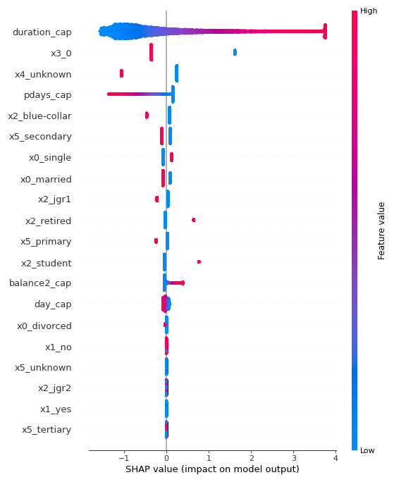
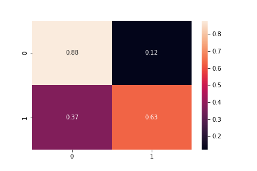

# Term Deposit Prediction

This project is about predicting Term Deposit Subscriber. This project is part of DSI Data Exhibitions.

## Setup

Start the project with environment setup and run the jupyterlab

```
pip install virtualenv
virtualenv dsi
source dsi/bin/activate
pip install -r requirements.txt
jupyter lab
```
or run this script for windows users
```
pip install virtualenv
virtualenv dsi
.\dsi\Scripts\activate
pip install -r requirements.txt
jupyter lab
```

or run this repo in [this docker](https://hub.docker.com/r/alamhanz/jupebase/tags)

## Structure

```
    |--artifacts
    |--data
        |--raw
        |--interim
        |--processed
        |--externals
    |--notebooks
    |--queries
    |--reports
        |--figures
    |--src
```

## Summary Results

### Iteration 2 Results

The best features to predict Term Deposit is Duration. The longer the call duration, the more possible a customer become subscriber.
However, because this relation is still correlation (not causation) the customer interest that may make the duration call longer.



Also, the evaluation of the model is still low. The Recall is 0.63 with Precision 0.42. There should be a better feature engineering to be done.




## Reference

* This project use data science template [here](https://github.com/alamhanz/data_science_template)
* Data source [here](https://docs.google.com/spreadsheets/d/1eCCy19ScSG9AggvyNtlsaHcemsX8byPgwNxOzYJoEws/edit#gid=1333185318)
* Credit to [Nadif](https://github.com/nadifwahdi) for the data
